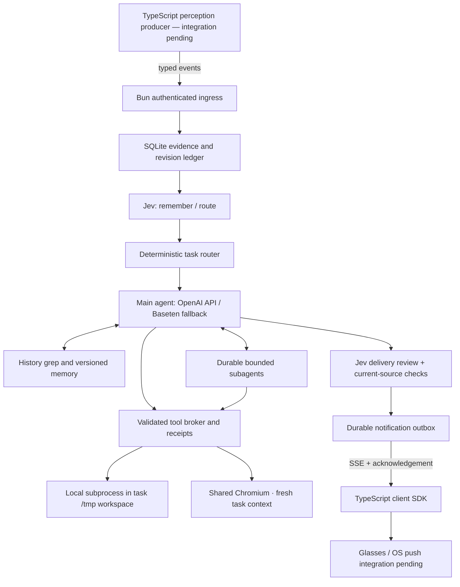

# KAWK memory and agent harness

Status: first runnable harness implemented on `chud3-ai-agent`, 2026-09-19.
The 2026-09-20 integration adds a PWA, capture adapters, LLM reminder wakes and shared
concurrent context; see the [current pipeline](PIPELINE_OVERVIEW.md) and
[verification report](AMBIENT_INTEGRATION.md).
Based on William's `chud3`; the original checkout and Python prototype are preserved.
[Run commands, API, verification and limits](../agent/README.md).
The [ambient memory extension](AMBIENT_MEMORY.md) adds transcript archives, the
temporal graph, history grep, reminders and clock mapping. The current runner uses
[local /tmp workspaces and Playwright](LOCAL_RUNNER.md); Docker has been removed.

## Purpose and boundary

KAWK is an ambient glasses agent with retroactive context. A wearer asks naturally,
without mentioning the assistant. The system retrieves or investigates when Jev
identifies useful work, and notifies only when a proposed answer passes delivery
checks. Ordinary conversation can supply memory without producing an interruption.

The computer client and agent runtime are TypeScript/Bun. Python runs model serving
on Baseten. Interop is HTTPS/WebSocket inference responses normalized into typed
perception events, not a local Python bridge. This build implements the harness,
client SDK, PWA, TypeScript perception adapters and Web Push delivery. Baseten live
face/speech and OS push delivery remain unverified; physical glasses transport and
V1 data import remain integration work.
No Baseten deployment was changed. No Kubernetes is used.

Main agents and children now use the direct OpenAI Responses API with `gpt-5.6-sol`
and explicit reasoning `none`, replacing the subscription CLI as the default. One
reusable SDK client streams native function calls, with no subprocess per turn.
The owner-scoped durable transcript is replayed with `store:false`; no conversation
state is shared between owners or children. Baseten remains the provider fallback,
and Jev remains the activation/classification and delivery-review model. The CLI
adapter is retained only as an explicitly selected legacy comparison.

## Reference

Reference-only: `martin226/psi`, `feat/multi-user-discord`, commit
[`8ec11157e84c82ce0f8cbbd9079259ec91dc786b`](https://github.com/martin226/psi/tree/8ec11157e84c82ce0f8cbbd9079259ec91dc786b).

| psi pattern | KAWK implementation |
|---|---|
| Scoped permanent facts and context assembly | Revisioned evidence, SQLite FTS, versioned facts/episodes/intentions |
| Intent classifier and turn router | Independent memory selection and start/update/cancel routing |
| Durable harness and dependability store | Persistent transcripts, tool receipts, recovery and task budgets |
| Subagent manager | Bounded children, messages, status, cancellation and parent resumption |
| Scheduler | Related due reminders wake one LLM task, then reviewed notifications enter a durable outbox; speculative follow-ups re-enter Jev |
| VM agent and sandbox tools | Host subprocesses in /tmp task workspaces + local Playwright contexts |

Discord mention policy and cluster claims were not copied. The Python migration
references remain `tools/perception_lab/product*.py`, `hub/remember_hub/perception/`
and `deployments/`. Source-time/identity requirements come from
[KAWK_PIPELINE.md](KAWK_PIPELINE.md).

## Architecture

Ingestion commits before returning and runs independently of agent turns. The
service polls durable work while idle without making model calls. Only finalized
new/current evidence enters classification; duplicate delivery does not repeat work.

## Memory and evidence

`agent/src/contracts.ts` defines validated event IDs, device/stream IDs, immutable
revisions, source start/end, finality, text, confidence, provenance and separate
speaker/person fields. Owner identity is bound by server configuration, never by
an untrusted event's payload. This first service has one configured wearer.

The ledger preserves revisions and original source times. Context queries use the
source interval rather than speech arrival time. FTS searches sources and derived
memories independently. Memory records have a stable key, version, kind and source
references; newer versions supersede earlier ones. An observed person is not
asserted to be a transcript's speaker.

Correction/deletion invalidates dependent tasks, memory and notifications. Deletion
purges derived transcripts and marks screenshots unavailable. Raw observations may
still be recalled after deleting only a derived memory summary; source deletion is
an explicit separate API. Non-content tombstones prevent reimport.

Seven-day retention removes unpinned observations and old task content. Raw
transcripts default to no automatic expiry, with a separate retention setting. Active
memories and unfired intentions pin their sources. The database admission watermark
provides explicit backpressure. Retention and the watermark are configurable;
media pin quotas and AV storage remain future extensions. Source-time/person
transcript filters and an evidence-backed entity/relation graph are implemented.
Retrieval starts with `grep_history`: ripgrep over the account-scoped durable history,
including unexported speech, with exact evidence references. The agent follows matches
with original-source and nearby-context reads. Keyword FTS and the relationship graph
remain available. The semantic service bridge was removed at the user’s request;
see [history search](HISTORY_SEARCH.md).

## Classification and delivery

One documented TypeSafe question-bank request asks about memory selection and a
broad route choice, with active-root target selection when needed. The route sets
activation; a redundant binary act question was removed after contradictory live
decisions suppressed valid reminders and recall. The router
rechecks source revision, owner and active task after the network call. Jev failures
retain evidence and retry with bounded backoff; they never start generic work as a
fallback. Operators can retry exhausted jobs explicitly.

Memory-only tasks can retrieve, remember and schedule; they cannot browse, execute
code or send a notification. Assist tasks may use the full enabled tool set.
Updates arrive as durable messages at model/tool boundaries. Plans generated before
an update are discarded before execution. Cancellation invalidates the tree and
interrupts provider and runner operations.

An agent must call `finish`; plain prose never becomes a notification. Parent-only
delivery checks current references, text, confidence, task mode, duplicate text and
expiry. A second Jev call reviews the proposed answer against cited sources and the
original need. A failed review suppresses delivery. This does not establish measured
semantic correctness; model quality needs annotated ambient replays and evaluation.

## Execution and recovery

Task states are queued, running, waiting, completed, abstained, cancelled and failed.
SQLite checkpoints messages, source dependencies, budgets and pending tool calls.
Children share root budgets and deadlines, receive selected context, and report only
to their parent. A child completion wakes a waiting parent through a durable message.

Default limits are two executing parent tasks per owner, four concurrent task loops, two children
per root, depth one, 32 turns, 160,000 accounted tokens and three minutes per task tree.
Context and tool output are bounded. One model response can overshoot the token budget
before its usage is known. No unbounded agent loop runs between perception events.

OpenAI streams native function calls and their IDs into the existing host-tool
protocol. Partial or failed streams never dispatch tools. The optional Codex adapter
uses a schema-constrained envelope with its native tools/MCP/rules disabled. Baseten uses the
standard documented tool-calling completion protocol. Fallback applies to provider
failure; cancellation does not start another provider call.

Tool receipts precede dispatch. Completed results are reused after a crash. Read-only
operations can replay; an interrupted uncertain effect fails for inspection. Durable
tasks survive in SQLite, but local process handles and browser contexts do not
reattach after restart. Normal task cleanup and service shutdown terminate owned
process groups, close contexts and delete task workspaces.

Code executes as the host user in `/tmp/kawk-*`, with host filesystem and network
access. Local Playwright reuses one Chromium process with fresh contexts per task;
localhost navigation works. Browser click/type remain opt-in, and page text remains
untrusted model input. This is the user's hackathon workspace model, not an OS sandbox.
Command deadlines/output caps and existing schema/capability checks remain.
Screenshots are downloadable artifacts, not multimodal input to the current adapter.

## What was built and verified

| Build slice | Result |
|---|---|
| Contracts/store | SQLite WAL, evidence/revisions, memory/FTS, owner scope, dependency invalidation, retention |
| Classification | Live-protocol Jev adapter, durable queue, retries, routing, independent delivery review |
| Agent | Direct OpenAI Responses adapter, optional Codex comparison, Baseten fallback, bounded tool loop and checkpoints |
| Subagents | Durable spawn/message/status/cancel/wait and completion propagation |
| Tools | Local code execution, /tmp workspace files, process polling and local browser operations |
| Service/client | Authenticated HTTP/SSE SDK, schedules, acknowledgements, graceful stop, macOS launch helper |

Verification includes offline provider fixtures, corrections/deletion, restart and
receipt replay, source-time context, child resumption, steering, deadlines, delivery
suppression and retention. Current local runner verification is in [LOCAL_RUNNER.md](LOCAL_RUNNER.md). Historical Docker tests passed before that migration. A real Codex
subscription completed a three-turn memory retrieval and acknowledged notification
using an explicit fixture gate and synthetic evidence. The fixture demo also passes.

A follow-up credentialed check passed the full live Jev → Codex → Jev review →
notification/ack path. Baseten `openai/gpt-oss-120b` passed a tool-calling fallback
check after an injected Codex-provider failure. Filler/quoted speech stayed quiet;
a natural recall question activated, a personal preference selected memory, and an
unsupported answer was rejected. Classifier snapshots now exclude transport metadata
and provenance labels, which had distorted the first live activation probe. Full
source metadata remains in the ledger and agent context. Credentials are local and
gitignored. The launchd file is validated but not installed. Camera/device end-to-end
verification remains pending; real-model ingestion-to-answer samples are now recorded
in the [ambient memory verification](AMBIENT_MEMORY_VERIFICATION.md). Next integration work is to connect the
TypeScript capture/perception producer and notification display to this SDK, preserving
existing gallery IDs and source timing without requiring a local Python application.
