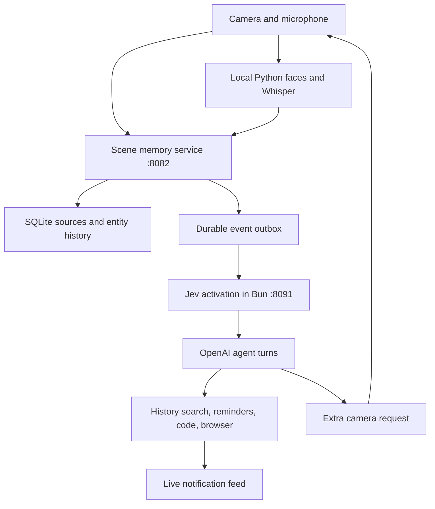

# Merged demo — 2026-09-20

This checkpoint integrates the current “Build 4D video scene demo” code with the
ambient agent. The original brief calls for timestamped speech, same-image face
identities and image descriptions to update persistent people, objects, places and
events, plus a separate agent that answers questions and acts when useful.



## Start

Requires Node22+, Bun1.3.2+, uv, ripgrep, the existing local perception models and
private `agent/.env` containing `OPENAI_API_KEY` and `TYPESAFE_API_KEY`.
Use the existing credential file; do not put keys in git or browser code.

```sh
# Repository root. Reuse the existing :8081 server if it is already running.
make serve-ui
# Separate terminal, repository root:
cd memory
npm ci
npm run build:client
cd ../agent
bun install --frozen-lockfile
bun run browser:install
bun run demo:stack
```

Open **http://localhost:8082**. The launcher connects memory and the agent with a
server-side token automatically. It refuses occupied ports, forces local speech
and disables Baseten. Ctrl-C stops its two children and leaves perception running.
Optional `MEMORY_DATA_DIR=/absolute/path/to/existing/memory/data` reuses an existing
scene store and photos. Stop its old memory process first: never run two writers
against that directory. Agent data defaults to `agent/data/`.

### Use the app

1. **Agent → Send** asks a question or runs a task. It works with capture stopped.
   Try: “Remind me in 20 seconds to stretch,” then “Use code to calculate 17 × 23.”
   Answers appear beneath the input; Tasks shows progress and Cancel.
2. **Start** enables the selected camera and microphone. On the serving Mac,
   choose iPhone Continuity Camera, laptop microphone and local speech. Natural
   conversation can then trigger Jev without a wake word.
3. **Search** queries stored observations. It is separate from asking the agent;
   keyword mode matches literal text rather than interpreting a question.
4. Source age and the memory queue describe derived scene-memory freshness.
   Accepted uploads, completed interpretations and failed interpretations are
   distinct. Transcripts and interpreted camera events reach the agent before
   the ordered scene writer finishes.

If you are connected to the serving Mac over SSH, `localhost` on your own laptop
is a different machine. Forward the UI with `ssh -L 8082:127.0.0.1:8082 user@mac`,
then visit your laptop's localhost:8082. Capture uses the browser's own devices;
Continuity Camera must be selected in a browser on the Mac where it is available.

### Direct phone access with HTTPS

Optional HTTPS shares the exact same pipeline, gallery proxy and agent:

```sh
# Repository root. Use your actual LAN IP instead of 192.168.1.20.
mkdir -p memory/data/tls
mkcert -install
mkcert -cert-file memory/data/tls/cert.pem -key-file memory/data/tls/key.pem localhost 127.0.0.1 192.168.1.20
cd agent
MEMORY_TLS_CERT="$PWD/../memory/data/tls/cert.pem" \
MEMORY_TLS_KEY="$PWD/../memory/data/tls/key.pem" bun run demo:stack
```

On the same network, open `https://192.168.1.20:8443`. The phone must trust the
certificate's CA: transfer **only `rootCA.pem`** from `mkcert -CAROOT`, install its
profile, then enable it in Settings → General → About → Certificate Trust Settings.
The CA private key stays on the Mac. Use an existing trusted certificate instead
when available. Regenerate the server certificate if its IP/hostname changes.
See [mkcert's mobile-device instructions](https://github.com/FiloSottile/mkcert#mobile-devices).

For iPhone Web Push, add the HTTPS app to the Home Screen and enable notifications
from that installed app with a user gesture. This is an [Apple platform requirement](https://webkit.org/blog/13878/web-push-for-web-apps-on-ios-and-ipados/).
HTTPS tests on a laptop do not prove phone certificate trust or lock-screen delivery.

In the Agent panel, press **Enable notifications**, then **Send test push**.
The first click asks the browser for permission; no token is needed. If setup
failed, **Retry push setup** fetches the key/registration again. Disable removes
this browser subscription. “Sent” means the push service accepted the message;
confirm the actual banner with the app backgrounded, then tap it to open/focus
the answer. Merely receiving an SSE update in a hidden tab does not acknowledge it.

### Read the logs

`GET /api/health` reports queue depth, failed/committed counts, oldest pending age,
derived-memory age and recent context/model/commit timings. `GET /api/agent/status`
reports connectivity, bridge retries and active turns. The memory process also
prints a content-free JSON health record every 30 seconds; redirect the launcher
output to a local file if desired. Provider attempts remain in
`$MEMORY_DATA_DIR/model-latency.jsonl`; agent timings are in `agent/data/telemetry.jsonl`.
Keep these private, and do not infer latency from the five-second capture interval.

For pre-hardware QA, select iPhone Continuity Camera and the laptop microphone.
Opening the page does not begin capture; press Start. An iPhone opening the web
page directly needs trusted HTTPS for camera/mic permissions. Physical glasses
transport remains a separate integration step.

## What is connected

- Raw transcript revisions commit independently of Jev, then a transactional
  outbox retries delivery to the agent. Agent history remains searchable with
  ripgrep across hourly JSONL partitions and the active SQLite journal.
- Five-second photos keep source capture time, same-image face evidence and the
  rolling timestamped transcript. Vision descriptions reach the agent before the
  slower ordered memory writer completes. Capture cadence is not answer latency.
- The existing scene store retains entities, source observations, corrections and
  removals. Agent scene search defaults to literal keywords; its existing vector
  search remains optional. Imported notes are revalidated before delivery so a
  superseded/deleted note cannot support a new answer.
- Integrated Jev decisions can request a fresh camera frame. The browser claims
  the request once, preserving the normal capture schedule. Requested frames take
  the next vision-worker slot; they do not cancel an already running API call.
- One Python gallery owns face enrollment and identity. Its Jev name-binding guard
  remains separate from harness activation. A visible person is not a verified
  speaker or wearer. This demo assumes one wearer.
- Reminders are durable and wake an LLM turn. Related due reminders are grouped;
  turns share refreshed evidence and compact older context. Code/browser work runs
  locally in task-specific `/tmp` directories; no Docker or Kubernetes.

## Checkpoint verification

Current checks: **443 Python, 84 agent, 293 memory and 107 client tests passed**, plus
**52 isolated browser checks**. This includes
outbox outage/restart and rollback behavior, transcript revisions, same gallery IDs,
fresh-camera claim/session/expiry checks, stale-source rejection, and recovery from
invalid memory batch reuse without rerunning image inference. UI checks are recorded
separately in `MERGED_UI_VALIDATION.md` when Claude's validation completes.

```sh
make test
cd agent && bun run check
cd ../memory && npm run check && npm test
npm run check:client && npm run test:client && npm run build:client
```

These are controlled tests, not evidence that iPhone capture or hardware is ready.
At integration time the older live memory process had about six minutes of backlog.
Source-time alignment and fresh-frame priority prevent treating an old scene as
current; they do not eliminate slow vision/writer calls. Existing batch failures
now retry individually. The [merged live-provider report](MERGED_E2E_VALIDATION.md)
records12 passing controlled checks, local perception probes and measured latency;
iPhone/hardware testing remains separate.

The later throughput repair replaces the writer's vector lookups with indexed
keyword retrieval and removes per-entity full-history attribute scans. It also
reserves concurrent upload capacity and recovers invalid batch outputs as checked
individual updates. Rejected interpretations retain their raw sources; a failed
count is not a count of deleted recordings. See the latest section of the live
report for the rerun and measured improvements, rather than the initial timings.

Next live acceptance cases: where are my keys; summarize today's class; recall
William's conversation; enroll/rename a person; remind me about Vitamin B when
Kenny appears; request a fresh visual answer between scheduled frames; run a browser
task while a 20-second reminder is pending; cancel a task; correct/delete a memory
and confirm it is no longer cited. See existing browser/file and single-wearer
benchmark reports for earlier component runs, not merged-device guarantees.

## Provenance and remaining limits

The scene app and latest local perception/name-binding changes were imported from
the user's `htn2026-chud3` worktree; that worktree and its private data were preserved.
PSI is an architectural reference only; no PSI implementation was imported.
This checkpoint implements merged Web Push and has a real FCM acceptance receipt;
it does not claim observed iOS background delivery, glasses display,
automatic wearer recognition, or reliable speech/face accuracy in venue conditions.
