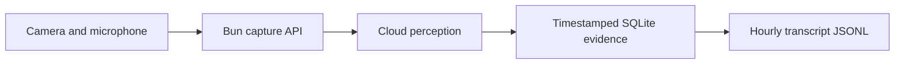
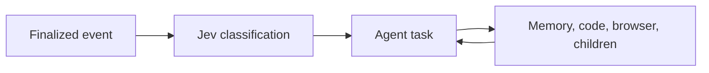
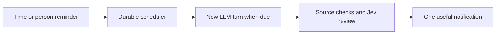
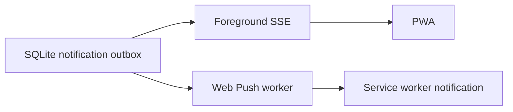

# KAWK pipeline

Current worktree: `htn2026-chud3-ai-agent`, branch `chud3-ai-agent`.
Computer client and harness: TypeScript/Bun. Python runs the existing perception models on Baseten. No Docker, Kubernetes, local Python relay, or semantic memory search.

## Capture and recording

The PWA sends JPEG frames (maximum long side 640) and mono 16 kHz PCM16. Three clock samples estimate client/server offset and uncertainty; audio timestamps begin at the first sample actually sent after cloud readiness. Cloud startup audio is discarded, not replayed. Whisper partials and finals become successive immutable revisions. Every accepted transcript revision is journaled regardless of Jev. Completed hourly JSONL partitions flush atomically; grep reads current persisted history across any number of hours before export too.

The browser timestamps its sampling point; the default 50 ms allowance is an application estimate, not measured sensor-to-browser calibration. Physical glasses still need capture-clock metadata to establish tighter bounds.

Frames are kept in a 120-second SQLite buffer, pruned on ingestion and periodic maintenance. Baseten InsightFace produces boxes and 512-dimensional face embeddings; these are only for face identity, not semantic memory retrieval. OpenAI describes a frame at most every five seconds, with at most one scene request per stream in flight. Slow perception drops superseded pending inference frames while retaining the raw capture-time buffer.

`identify_person` selects processed frames around the original utterance interval. Enrollment requires at least two frames, exactly one detected face (including small rejected detections), stable tracking, declared timing error no greater than one second and sufficient coverage. Jev independently checks the spoken name. `enroll_person` saves a calibration image/embedding and a graph identity; renaming preserves the gallery UUID. Ambiguous, replaced or expired targets are rejected. A stable recognized appearance can trigger a person reminder; continued presence does not repeatedly create appearance events.

## Jev and agent turns

Jev runs alongside recording and agent tasks. One incoming classification is in flight; its independent `remember` decision and `observe/start/update/cancel` route can select memory work, assistance, or steering. It receives source dates, local time, age, arrival delay, timing uncertainty, recent context and the actual gap since previous finalized speech, even across hours. No wake word is required. Jev is a classifier, not the agent or a visual model.

The custom harness uses the official OpenAI Responses SDK, `gpt-5.6-sol`, reasoning `none`, `store:false`, native tool-call IDs and no SDK retries. Pi is not embedded. PSI inspired design concepts; the KAWK prompt is original and a source similarity audit is recorded separately. Tool arguments are validated with Zod and execution receipts are durable.

Up to four tasks run concurrently, including up to two parent tasks for the same owner and two children per parent. Each has its own model history. Every model call gets a fresh bounded snapshot of peer status/results, recent evidence, facts, pending reminders and the clock. Children report through durable mailboxes; waiting releases the worker. New steering discards unexecuted plans. At 80,000 serialized context characters, an additional model call summarizes older complete turns; the full pre-compaction history and summary are saved in `task_checkpoints`. Raw evidence remains authoritative. Default root budget: 32 turns, 160,000 cumulative model tokens; parent deadline 180 seconds. Compaction consumes budget too.

Code runs directly on the host in per-task `/tmp/kawk-*` workspaces. This is workspace separation, not an OS sandbox. Local Playwright shares one Chromium process and gives each task a separate browser context. Browser and code tools share that task's files. Browser tools expose page text/accessibility, control selectors, focused text reads, native forms, uploads, downloads and tabs. `export_file` preserves deliverables before workspace cleanup; artifacts are served through the owner-scoped API. File transfers/exports are limited to 10 MiB per file. Process polling can wait briefly without blocking the scheduler. Interactive actions require `KAWK_BROWSER_INTERACTION=1`. [Actual browser/file task validation](BROWSER_FILE_VALIDATION.md).

The runtime timezone controls dates and reminders; it is not evidence of the wearer's location. A weather request without a supplied or verified current location must ask for the city.

## Memory and reminder turns

Memory has three layers: raw source history, versioned keyed facts/episodes/intentions, and a SQLite graph of people, objects, places, events and topics. Claims cite source revisions; corrections invalidate dependent work. Retrieval uses ripgrep, keyword FTS, source-time windows and graph traversal. There is no vector or semantic retrieval service.

A reminder is a database row, not a sleeping process. Relative time starts at the original utterance. Due time or a fresh recognized appearance queues a new assist task directly, because the reminder was already authorized. It does not need another activation classification. Related already-due reminders for the same owner/person are grouped into one wake. The LLM checks current shared context, combines useful items and can finish quietly if resolved. Failed wake tasks are exposed as failed reminders rather than silently retried forever. Speculative `schedule_followup` still re-enters Jev.

`finish` validates current references, confidence and task scope. Jev reviews `supported / unsupported / uncertain`; support must reach 0.8. A rejected answer gets one opportunity to retrieve missing evidence and correct it, then must finish or abstain. Exact duplicate text is suppressed for 60 seconds. This is bounded source repair, not a guarantee that the model or reviewer is correct.

## PWA and delivery

Bun serves `agent/web/` and the authenticated APIs. The local page connects automatically through a same-origin session request, creating a 24-hour HttpOnly SameSite cookie without token entry. Scripts can still use the client token; provider credentials stay in Bun. SSE checks the outbox every 100 ms; acknowledge is explicit. The `web-push` library handles encrypted background delivery with persistent VAPID keys/subscriptions, retry records, and removal of expired subscriptions. Reminder notifications remain available for 24 hours; ordinary notifications expire after 30 seconds. OS delivery requires browser notification permission and a valid push subscription. A phone needs an HTTPS origin; localhost is suitable for desktop development. No physical glasses display is implemented.

## Testing state

See [integration results](AMBIENT_INTEGRATION.md) and [Claude's PWA checks](PWA_VALIDATION.md). Synthetic replay with real providers is not a live camera/glasses benchmark. Baseten is currently unavailable per the user; `KAWK_BASETEN_ENABLED=0` disables face, Whisper and model fallback without disabling OpenAI scene descriptions or manual transcript input.

Run from `agent/`: `bun run build:web`, `bun run check`, then `bun start`. Open `http://127.0.0.1:8091`; it connects automatically. The script client token remains in ignored `agent/data/client-token`; do not commit it. Restore Baseten with `KAWK_BASETEN_ENABLED=1` once the service and credentials work.
